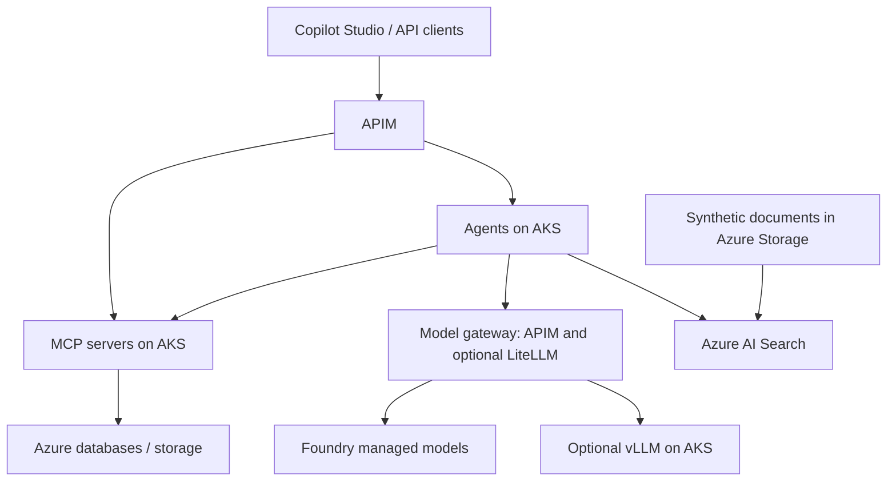

# Architecture outline

The platform separates user experience, gateways, runtime, AI/data services, and shared security/operations.

The accepted direction, rationale, tradeoffs, and unresolved choices are recorded in [ADR 0001](../decisions/0001-enterprise-ai-platform-architecture.md). The proposed reference-architecture adaptation and phased implementation are in [ADR 0003](../decisions/0003-adapt-ai-landing-zone-for-aks.md); AKS remains the agent, MCP and future self-hosted model runtime. Delivery milestones are in the [POC roadmap](../roadmap.md).

Arrows describe logical calls/data flow, not a finalized network topology. APIM's API and model gateway roles may use the same deployment.

## Trust boundaries

- Private networking controls reachability; it does not grant permission to invoke a tool or read data.
- Authenticate clients at ingress, then authorize individual operations and data access in the responsible service.
- Distinguish workload identity from delegated user identity; decide whether each downstream call needs user delegation or application permissions.
- Propagate trace context without logging credentials or sensitive prompts/documents by default.
- Apply retrieval access filters before returning content to the model.
- Treat retrieved documents and tool output as untrusted input; enforce tool allowlists and validate arguments.

## Decisions to validate

- Power Platform Managed Environment licensing, region pairing, DNS behavior, and connector/MCP support for private networking.
- APIM tier support for required inbound/outbound network paths and AI/MCP gateway features.
- APIM alone versus APIM plus LiteLLM for per-client metering and cost/budget requirements.
- Application stack, private AKS access/deployment path, and model availability/quota. Terraform and GitHub Actions OIDC are already implemented for the foundation.
- Content safety, authorization, distributed tracing, and evaluation integration for custom AKS workloads.

Multi-cloud networking and self-hosted GPU inference are later extensions. The initial path should work entirely in Azure.
