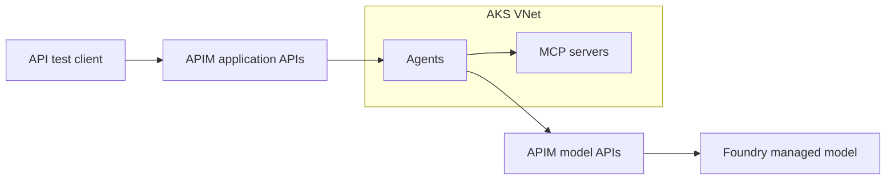

# Architecture outline

**Current first milestone:** [Foundry + internal APIM model gateway](../runbooks/model-gateway-first.md), with two secretless test-client IDs, content filtering, request/token limits and per-client cost reporting. AKS/ACR/MCP are removed from the active Terraform root and deferred. Earlier AKS inventory and plan evidence below are historical; this milestone supersedes that sequence.

**Scope priority:** [POC goal and success criteria](poc-success-criteria.md) govern implementation: Copilot Studio → APIM → internal MCP on AKS, with APIM model calls and per-client token/cost attribution. Copilot connectivity is core; only its additional VNet deployment is deferred from the initial network change. RAG and GPU inference remain later extensions.

The platform separates user experience, gateways, runtime, AI/data services, and shared security/operations.

The accepted direction, rationale, tradeoffs, and unresolved choices are recorded in [ADR 0001](../decisions/0001-enterprise-ai-platform-architecture.md). The proposed reference-architecture adaptation and phased implementation are in [ADR 0003](../decisions/0003-adapt-ai-landing-zone-for-aks.md); AKS remains the agent, MCP and future self-hosted model runtime. Delivery milestones are in the [POC roadmap](../roadmap.md).

## Initial deployment

One VNet for AKS, with only the subnets required by its chosen network configuration. No additional Copilot VNet, hub network or RAG services are deployed initially. The prepared revision uses internal APIM and private gateway DNS. Administrator tests run from a private Linux VM reached through Bastion Basic. These add admin/Bastion subnets within the same VNet; see the [cost review](cost-review.md). AKS control-plane access remains Entra-authenticated public access; this revision does not silently make the cluster API private.

APIM's API and model gateway roles may share one deployment. Arrows show logical calls, not a finalized network topology.

## Later extensions

- Separate VNet for Copilot Studio agent connectivity; validate the supported Power Platform topology and required network resources when implementing it.
- RAG using AI Search, document storage, ingestion and embeddings.
- Self-hosted LLM on a dedicated AKS GPU user node pool, with gateway integration and explicit safety controls.

## Trust boundaries

- Private networking controls reachability; it does not grant permission to invoke a tool or read data.
- Authenticate clients at ingress, then authorize individual operations and data access in the responsible service.
- Distinguish workload identity from delegated user identity; decide whether each downstream call needs user delegation or application permissions.
- Propagate trace context without logging credentials or sensitive prompts/documents by default.
- Apply retrieval access filters before returning content to the model.
- Treat retrieved documents and tool output as untrusted input; enforce tool allowlists and validate arguments.

## Decisions to validate

- Later Copilot phase: Power Platform licensing, region pairing, DNS and connector/MCP network requirements.
- APIM tier support for required inbound/outbound network paths and AI/MCP gateway features.
- APIM alone versus APIM plus LiteLLM for per-client metering and cost/budget requirements.
- Application stack, AKS API/ingress access and deployment path, and model availability/quota. Terraform and GitHub Actions OIDC are already implemented for the foundation.
- Content safety, authorization, distributed tracing, and evaluation integration for custom AKS workloads.

Multi-cloud networking and self-hosted GPU inference are later extensions. The initial path should work entirely in Azure.
