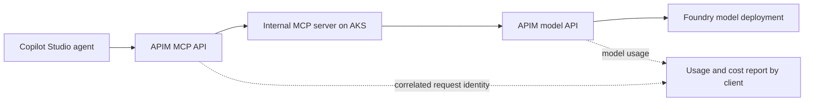

# POC goal and success criteria

**Current first milestone:** [Foundry + internal APIM model gateway](../runbooks/model-gateway-first.md), with two secretless test-client IDs, content filtering, request/token limits and per-client cost reporting. AKS/ACR/MCP are removed from the active Terraform root and deferred. Earlier AKS inventory and plan evidence below are historical; this milestone supersedes that sequence.

The primary goal is to validate connectivity from a Copilot Studio agent to an internal MCP server hosted on AKS, use APIM as the AI gateway, and especially demonstrate token usage and cost attribution per client. Build only the simplified AI landing zone needed to support that test.

This scope clarification takes precedence over earlier sequencing that treated Copilot integration as an optional late extension. A separate Copilot connection VNet remains deferred from the immediate AKS network change, but the supported Copilot-to-internal-MCP path must be validated early and completed within the core POC.

## Target flows

This is the proposed logical test path, not a claim of validated connector or network support. Choose a model-backed MCP tool so one Copilot invocation can demonstrate connectivity and attributable model usage together. If an AKS agent orchestrates the model call, it sits between the MCP tool and the APIM model API and preserves the same client context. AKS remains the runtime for custom agents, MCP and future self-hosted models; a separate agent service is only needed for this test if it contributes to the flow.

The MCP server remains internal. Determine the supported Copilot connection, authentication, MCP transport, APIM exposure and private backend routing before selecting APIM tier or cluster ingress. Public APIM ingress and fully private Copilot ingress are different options; record the selected path explicitly. Do not expose the MCP backend publicly as an implicit shortcut.

## Required proof

| Goal | Acceptance evidence |
| --- | --- |
| Copilot connectivity | A Copilot Studio agent discovers/invokes the intended MCP tool through the selected APIM path and receives its result from AKS |
| Internal runtime | MCP has no direct public ingress; APIM reaches it through the intended internal route; direct unauthorized access fails |
| AI gateway | The tool's model calls pass through APIM to Foundry; runtime identity cannot bypass the intended model policy boundary |
| Per-client attribution | At least two authenticated client identities execute distinguishable test workloads; requests and model calls map to the correct client without trusting arbitrary caller-supplied headers |
| Token accounting | Record input/output tokens where returned by the model, model/deployment, request/correlation IDs, outcome and timestamp; handle retries, streaming and missing usage explicitly |
| Cost reporting | Produce per-client token totals and estimated model inference cost using a dated price table for the actual model/deployment; distinguish cached or other billable token categories where applicable |
| Reconciliation | Compare client totals with captured gateway/model usage for the test window; explain missing/duplicate usage and billing differences |
| Repeatable landing zone | Terraform/GitHub Actions deploy the minimum resources, identities and monitoring; cleanup instructions identify resources outside Terraform |

"Client" initially means an authenticated consuming application or calling system, not automatically a human end user. Before implementing attribution, verify which caller identity Copilot exposes and define how it maps to a client. If multiple Copilot agents share one connection identity, do not claim they are separately metered without a trusted distinction. A second API test client can demonstrate separation; document which identities were actually exercised.

An MCP invocation is not itself an LLM token measurement. The report covers model calls routed through our gateway. Copilot Studio's own orchestration/model consumption, licensing and credits are a separate cost boundary. Do not claim APIM observes those costs. Shared infrastructure charges for AKS, APIM, monitoring and networking are reported separately; any allocation to clients must state its method. Token-derived costs are estimates, not an exact Azure invoice or a spending cap.

## Minimal scope

- Existing subscription, POC resource group, OIDC pipeline and remote state.
- One AKS VNet now; only required subnets and the internal APIM-to-MCP route.
- Small CPU AKS runtime, image registry, one model-backed MCP tool.
- APIM MCP/application and model API roles; assess whether one instance meets both connectivity and accounting needs.
- One Foundry resource/project and one managed model with supported filters.
- Runtime identity, authentication/authorization, correlated telemetry and a per-client usage/cost report.
- Separate Copilot connection network later in the implementation sequence if required by the selected integration; no full enterprise networking rollout.

RAG, AI Search, embeddings, self-hosted GPU inference, multi-cloud, multi-region, extra agent orchestration and advanced governance services are outside the first validation. Keep future extension points without provisioning them now.

## Delivery order

1. Validate the exact Copilot/MCP authentication and transport path, APIM private backend connectivity, client identity propagation, usage telemetry and model availability. Record cost estimates for the minimum supporting SKUs.
2. Implement the AKS VNet and minimum runtime/gateway/Foundry resources. Complete an authenticated API-client-to-MCP-to-model test with per-client accounting.
3. Add the required Copilot connection networking/configuration and run the same tool from Copilot Studio. This is a core completion criterion, not an optional enhancement.
4. Run two-client attribution, authorization, token/cost reconciliation and cleanup checks. Publish the evidence and known limitations in the repository.

The immediate network change remains limited to the AKS VNet. Feasibility checks in step 1 prevent spending on a topology that cannot satisfy the primary Copilot connectivity goal.
