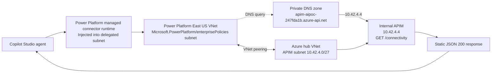

# Copilot Studio to private Azure connectivity

This document records the complete phase-one setup that was successfully
validated on 2026-10-02. The test deliberately uses a static APIM response so
network connectivity can be proven without deploying MCP, A2A, Container Apps,
AKS or Foundry.

## Validated architecture



Power Platform owns the managed runtime containers. Azure owns the VNets, DNS,
peering and APIM gateway. The runtime containers are not visible as customer
managed Azure Container Apps.

## Azure work

Terraform and the reviewed GitHub Actions workflow created or configured:

| Resource | Purpose | Result |
| --- | --- | --- |
| `vnet-aipoc-247fda1b` | Hub VNet and APIM subnet | Created |
| `vnet-ai-poc-powerplatform-eastus` | Power Platform delegated subnet | Created |
| `vnet-ai-poc-powerplatform-westus` | Required US geography pair | Created |
| `ep-ai-poc-network` | Network injection enterprise policy | Succeeded |
| VNet peerings | Route Power Platform traffic to hub | Succeeded |
| `apim-aipoc-247fda1b` | Internal API gateway | Developer, Internal, Succeeded |
| `apim-aipoc-247fda1b.azure-api.net` | Private DNS zone | Created |
| Apex A record | Maps APIM hostname to `10.42.4.4` | Created |
| `connectivity` APIM API | Static private-network probe | Deployed |

The probe policy returns:

```json
{"status":"ok","source":"internal-apim","network":"private"}
```

The standalone connector definition is
[`docs/connectors/copilot-connectivity-openapi.yaml`](../connectors/copilot-connectivity-openapi.yaml).

## Power Platform work

In the Power Platform admin center:

1. Confirm the environment is the intended **Default Directory** environment.
2. Confirm Dataverse is provisioned.
3. Enable **Managed Environment**. VNet support requires a Managed Environment.
4. Open **Security → Data and privacy → Azure Virtual Network policies**.
5. Assign `ep-ai-poc-network` to the environment.
6. Check environment history until subnet injection reports **Succeeded**.

In Power Apps:

1. Select the same environment.
2. Create a custom connector by importing
   [`copilot-connectivity-openapi.yaml`](../connectors/copilot-connectivity-openapi.yaml).
3. Use HTTPS and the APIM host from the OpenAPI file.
4. Use **No authentication** for this isolated probe.
5. Save the connector and test `getConnectivity`.
6. Share the connector with the agent maker/runtime as **Can use** if required.

In Copilot Studio:

1. Open the agent in the same environment.
2. Select **Tools → Add a tool → Custom connector**.
3. Select `AI POC Connectivity Probe v2`.
4. Add the `getConnectivity` action.
5. Select the working connector connection.
6. Save and test the agent with: `Call the private connectivity probe.`

The validated tool was `Check-private-connectivity`, which returned:

```json
{"network":"private","source":"internal-apim","status":"ok"}
```

## DNS and routing

The connector requests `apim-aipoc-247fda1b.azure-api.net`. The linked private
DNS zone returns `10.42.4.4`. Azure system routes and VNet peering carry traffic
from the delegated Power Platform subnet to the APIM hub subnet. The APIM NSG
allows HTTPS from the virtual network. No NAT gateway, VPN gateway, firewall,
private endpoint or custom route table is required for this probe.

## What this proves

The result proves:

`Copilot Studio → Power Platform managed runtime → delegated subnet → private DNS → VNet peering → internal APIM`

It does not yet prove MCP tool discovery, A2A messaging, model inference or
Container Apps/AKS backend connectivity. Those are later stages that can reuse
the same private gateway path.

## Cost and teardown

APIM Developer, ACR, Log Analytics and Application Insights can incur charges
while present. The failed Container Apps capacity attempt is not needed for this
probe. Use the reviewed Terraform `down` workflow to remove paid workloads while
retaining bootstrap state and the network policy as appropriate. Detach the
Power Platform environment before a full network destroy.

## Evidence

- Targeted probe deployment: [GitHub Actions run 36953129328](https://github.com/kxw9298/enterprise-ai-platform-poc/actions/runs/36953129328)
- Private connectivity milestone tag: `v0.1.0-private-connectivity`
- Consolidated deployment checkpoint: [`docs/runbooks/deployment-checkpoint.md`](../runbooks/deployment-checkpoint.md)
