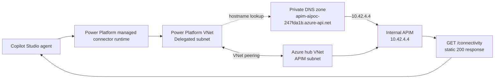

# Validating Copilot Studio private connectivity to Azure API Management

This post describes a small proof of concept for connecting a Copilot Studio
agent to an Azure service that is reachable only through a private network. The
test uses an internal Azure API Management (APIM) gateway and a static response.
It intentionally avoids deploying an LLM, MCP server or container workload so
that the first milestone measures network connectivity by itself.

## The goal

The target path was:

```text
Copilot Studio agent
  → Power Platform managed connector runtime
  → delegated Power Platform subnet
  → VNet peering and private DNS
  → internal APIM gateway
  → static connectivity response
```

The successful response was:

```json
{"status":"ok","source":"internal-apim","network":"private"}
```

This proves that the agent can invoke a connector whose destination is an
internal Azure gateway. It does not yet prove MCP protocol behavior, A2A
messaging or model inference.

## Architecture



APIM uses internal VNet mode. It is not an Azure Private Endpoint in this
design. Its gateway receives a private IP from the APIM subnet. The private DNS
zone maps the APIM hostname to that address and is linked to the hub and Power
Platform VNets.

## Azure implementation

Terraform created the Azure foundation and the APIM probe. The important pieces
were:

- A hub VNet with an APIM subnet.
- East US and West US Power Platform VNets with delegated subnets. The United
  States Power Platform geography requires the regional pair.
- VNet peerings between the Power Platform VNets and the hub.
- Enterprise policy `ep-ai-poc-network` with kind `NetworkInjection`.
- Internal Developer-tier APIM.
- Private DNS zone `apim-aipoc-247fda1b.azure-api.net`.
- Apex A record pointing to `10.42.4.4`.
- A keyless APIM API at `/connectivity` with an inbound policy that returns a
  static JSON document.

The probe has no backend. That is deliberate: the response is produced inside
APIM, so a failure cannot be confused with a failed container, image pull or
application route.

The implementation is in the repository:

- [`infra/modules/platform/gateway.tf`](../../infra/modules/platform/gateway.tf)
- [`infra/modules/platform/policies/connectivity.xml`](../../infra/modules/platform/policies/connectivity.xml)
- [`docs/connectors/copilot-connectivity-openapi.yaml`](../connectors/copilot-connectivity-openapi.yaml)

The targeted Terraform workflow applies only the three probe resources. This
keeps the test independent of the Container Apps regional capacity issue that
affected an earlier deployment attempt.

## Power Platform setup

Power Platform VNet support requires a Managed Environment. The Default
Directory environment was prepared with Dataverse and then associated with the
Azure enterprise policy in Power Platform admin center:

1. Open **Security → Data and privacy → Azure Virtual Network policies**.
2. Select the environment.
3. Assign `ep-ai-poc-network`.
4. Wait for environment history to show subnet injection **Succeeded**.

The enterprise policy and delegated subnets are created in Azure, but the
environment association is a Power Platform administration operation. Microsoft
documents this setup in [Set up virtual network support for Power Platform](https://learn.microsoft.com/en-us/power-platform/admin/vnet-support-setup-configure).

## Connector and agent setup

The connector was created in Power Apps using the standalone OpenAPI file:

1. Open the same Power Platform environment in `make.powerapps.com`.
2. Create a custom connector by importing
   `copilot-connectivity-openapi.yaml`.
3. Set the name to `AI POC Connectivity Probe v2`.
4. Use HTTPS and no authentication for this isolated probe.
5. Test `getConnectivity` in the connector Test tab.

The connector was then added to the agent:

1. Open the agent in Copilot Studio.
2. Select **Tools → Add a tool → Custom connector**.
3. Add `AI POC Connectivity Probe v2` and its `getConnectivity` action.
4. Select the working connector connection.
5. Ask the agent to call the private connectivity probe.

The agent tool `Check-private-connectivity` returned `status: ok`,
`source: internal-apim` and `network: private`.

## What made the test conclusive

The connector test from Power Apps and the agent test were performed after the
environment's network injection operation succeeded. The APIM hostname resolved
to `10.42.4.4` through the private DNS zone. The local Mac could not call that
address because it was outside the Azure VNet; that failure was expected and
helped confirm that the gateway was not publicly reachable.

The successful agent response therefore validated the private Power Platform
runtime path rather than a public APIM endpoint.

## Troubleshooting lessons

An enterprise policy can exist and be `Succeeded` in Azure but still not appear
in Power Platform. The Power Platform administrator needs read access to the
policy, and the environment must be in the matching geography. For the United
States geography, the paired Azure regions are East US and West US.

Connector permissions are separate from Azure permissions. The connector owner
must share it with the agent maker or runtime as **Can use**. A connector that
is visible but only grants **Can view** produces a Power Platform permission
error before any request reaches APIM.

A connector HTTP 503 is different from a connector permission error. First test
the operation in the connector's Test tab. If that succeeds but the agent fails,
remove and re-add the connector tool and create a new connection in the same
environment.

## Cost and cleanup

The main cost during the experiment was APIM Developer. ACR, monitoring and
Container Apps were also present during parts of the broader deployment work.
VNets, subnets and NSGs had no direct hourly charge in the cost report. The
Terraform `down` workflow removed APIM, ACR and monitoring resources while
retaining the network foundation and bootstrap storage.

The bootstrap storage account remains for Terraform state and has a small
storage/transaction cost. Cross-region peering can incur data-transfer charges
when traffic crosses regions.

## What comes next

The private path is now a reusable foundation. The next increment can replace
the static APIM policy with one of these backends:

1. A small private HTTP service.
2. A real MCP server in Container Apps.
3. An MCP or A2A runtime in AKS.
4. A Foundry model endpoint behind APIM.

Each addition should preserve the same acceptance test: first prove that the
agent reaches the private gateway, then test the backend protocol or model
behavior separately.

## Evidence

- Successful targeted deployment: [GitHub Actions run 36953129328](https://github.com/kxw9298/enterprise-ai-platform-poc/actions/runs/36953129328)
- Private connectivity milestone tag: `v0.1.0-private-connectivity`
- Full architecture record: [`private-connectivity-validation.md`](../architecture/private-connectivity-validation.md)
