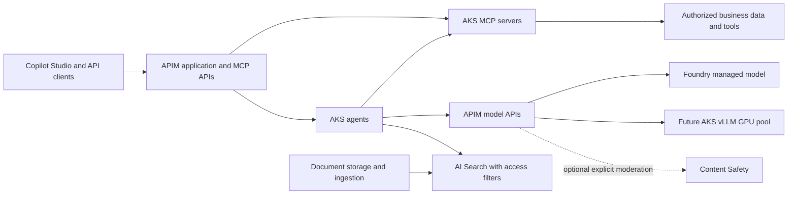

# ADR 0003: Adapt the AI Landing Zone for an AKS runtime

- **Date:** 2026-09-28
- **Status:** Proposed design refinements; AKS runtime requirement confirmed by the user
- **Scope:** Design and delivery plan only; no additional infrastructure deployed
- **Extends:** [ADR 0001](0001-enterprise-ai-platform-architecture.md)

## Context and reference

The user confirmed AKS remains the runtime for custom agents, MCP servers, and future self-hosted LLMs. Learn from the [Azure AI Landing Zones APIM reference diagram](https://github.com/Azure/AI-Landing-Zones/blob/main/media/AI-Landing-Zones-APIM.png), particularly its separation of application workloads, shared AI gateway services, and connectivity. The [reference repository](https://github.com/Azure/AI-Landing-Zones) allows its agent and gateway landing zones to be deployed independently. Its implementation is not an automatically validated blueprint for our AKS adaptation.

The existing design already has AKS, APIM, Foundry, private connectivity, and RAG. These changes clarify boundaries and sequencing rather than replace the architecture. The reference links track upstream main; implementation must record the versions of any adopted modules.

## Proposed changes

| Area | Existing direction | Refinement |
| --- | --- | --- |
| Runtime | Agents/MCP on AKS; later vLLM | Keep AKS; separate service accounts, namespaces and network policies; isolate future GPU workloads in a dedicated user node pool |
| Gateway | APIM ingress and possible model gateway | Use explicit application/MCP APIs and model APIs with separate authorization and policies; evaluate one APIM instance initially |
| Foundry | Managed models and AI capabilities | One current Foundry resource, one project, one initial chat deployment; shared model access through APIM; add projects/resources only for demonstrated isolation needs |
| Safety | Integration to validate | Test model filters immediately; define explicit moderation for future self-hosted models and optional central gateway moderation |
| Retrieval | Search and storage | Add document storage, embeddings and Search as a separate RAG phase; enforce document access before model context construction |
| Networking | Private connectivity target | One POC VNet with explicit subnet roles initially; reserve expansion space; validate gateway, runtime, DNS, developer and CI routes before provisioning |
| Organization | One POC resource group | Keep one subscription and the existing POC group; use Terraform modules and labels for logical ownership; retain separate bootstrap group |
| Delivery | Runtime before managed models | Validate a private managed-model/gateway path first, then connect AKS agents/MCP; check Copilot feasibility early even if integration comes later |

## Proposed request paths

Arrows are logical calls, not finalized routes. The APIM boxes are policy roles and may share one instance. Private Copilot reachability is a validation gate, not a demonstrated capability. Internal agent-to-MCP calls may remain inside AKS with service authentication and authorization; APIM is required for exposed client APIs, not every internal call.

## Boundaries and controls

### Gateway and identity

- Authenticate application callers and authorize application, MCP tool and model APIs separately. A subscription key may assist metering but is not the sole user identity.
- Agents and MCP servers use separate workload identities with only the necessary downstream permissions. Decide delegated user access versus application permissions for each business operation.
- Use APIM managed identity for supported Foundry authentication. Validate the chosen model API and role rather than assuming every backend has the same authorization scheme.
- Derive client attribution from validated identity and trusted application context; strip or overwrite client-supplied attribution headers. An AKS agent's identity alone does not identify its end user.
- Restrict access to model backends so application callers cannot bypass gateway policies; narrowly scope administrative/testing access. Private endpoints alone do not enforce this boundary.
- Keep APIM first. Add LiteLLM only if measured routing, protocol compatibility, metering or budget requirements cannot be met adequately. Do not assume provider usage totals equal an exact per-client invoice.

### Foundry and safety

- Use a current Foundry resource/project structure. The project supports organization, connections and applicable evaluations; it does not require moving custom agents into Foundry Agent Service.
- Do not provision the reference's full managed-agent dependency stack solely because it appears in the diagram. Cosmos DB, agent storage and other services require an actual application need.
- Keep supported managed-model filters enabled; test allowed/blocked prompts and outputs, streaming behavior, and failures. Optional explicit Content Safety calls need a defined timeout/failure policy and measured cost/latency.
- Self-hosted vLLM does not inherit Foundry filtering. Add explicit input/output moderation and evaluations before exposing it. Tool authorization, argument validation and retrieved-document defenses remain application responsibilities.
- Projects share parent resource configuration; use separate resources or subscriptions when stronger network or environment isolation becomes necessary. Do not treat a project or Kubernetes namespace as a complete security boundary.

### Networking and operations

- Proposed subnet roles: AKS nodes (with IP planning for the chosen CNI), private endpoints, APIM where its selected networking mode requires one, and private build/test access. Additional delegations, sizes and DNS zones remain to be selected.
- Validate APIM private inbound access and outbound connectivity separately; an inbound private endpoint does not by itself provide private backend access. Check [APIM networking options](https://learn.microsoft.com/en-us/azure/api-management/virtual-network-concepts) against the exact SKU.
- Plan private AKS API access and runtime deployment before enabling it. Hosted GitHub runners can perform many Azure control-plane operations but do not automatically reach private Kubernetes or service endpoints. Select an ephemeral runner or another supported private execution path; avoid a public-access exception as an implicit fallback.
- Preserve the functioning OIDC/state bootstrap. Any later state-storage network restriction requires a working runner route first.
- Use workload identity, Kubernetes RBAC, controlled image sources, resource requests/limits, pod security and network policies. Document image build/push and ACR pull access; select registry networking and SKU deliberately.
- Collect traces across gateway, agent, tool, retrieval and model calls. Record latency, errors, token usage, client attribution and filter events; redact secrets and keep prompt/document logging disabled by default.
- Start single-region. Defer hub firewall, ExpressRoute, multi-region deployment, semantic caching and governance workflow services until a requirement justifies their cost. This POC will not demonstrate those enterprise controls until implemented and tested.

## Implementation sequence and acceptance criteria

| Phase | Deliverable | Evidence required before moving on |
| --- | --- | --- |
| 0. Design validation | Region/model/quota checks; APIM tier comparison; IP/DNS plan; Copilot private-path feasibility; cost worksheet and budget alerts | Exact required features supported; recurring and usage charges estimated for planned runtime; unresolved blockers recorded |
| 1. Network and access | VNet/subnets, private DNS, runner/developer route, initial monitoring; reviewed deployment and runtime RBAC | Private DNS resolves correctly from intended callers; access denied from unintended paths; CI can reach required endpoints |
| 2. Managed model and gateway | Foundry resource/project, one chat deployment, filter configuration, APIM model API | Authenticated private call; unauthorized/bypass tests; attribution and safety checks; first measured usage/cost |
| 3. AKS application runtime | CPU AKS, registry, one agent and one MCP service, workload identity and deployment workflow | Agent calls model through APIM and invokes an authorized tool; denied tool/data cases fail correctly; traces span the request |
| 4. Enterprise retrieval | Synthetic document storage, ingestion, embedding deployment and AI Search | Grounded citations; document access filters; prompt-injection and cross-user data tests |
| 5. Copilot integration | Validated connector/MCP path and Power Platform configuration | Copilot reaches private application APIs using intended identity; authorization and attribution survive the full path |
| 6. Self-hosted model | Dedicated GPU user pool, selected model and vLLM, gateway routing and moderation | Capacity/quota available; protocol and safety tests pass; per-request attribution; measured cost and tested pool/model cleanup |

Power Platform licensing and networking feasibility are checked in phase 0 to avoid discovering a topology blocker in phase 5. GPU deployment is a later explicit milestone; start with CPU services and managed inference.

## Terraform and lifecycle plan

Keep `infra/poc` and `poc.tfstate` initially. Introduce modules incrementally for network, observability, Foundry, gateway, AKS and retrieval as each phase needs them. Consider pinned Azure Verified Modules where they fit; inspect defaults and avoid deploying the complete upstream stack automatically.

The current pipeline guard only permits the resource group. Update its resource/action allowlist and tests with each phase, preserving review of destructive changes. Do not simply remove the guard. The pipeline currently has Contributor on the POC group but cannot create role assignments: use the administrator bootstrap mechanism for narrowly scoped assignments initially, or record a separate decision for constrained RBAC delegation.

Retain manual plan/apply/destroy with reviewed commit evidence. Kubernetes deployment and private data-plane configuration need their own tested execution path. Keep credentials, state and plan artifacts out of Git.

Destroy in dependency order while the runner, identity, gateway connections and state backend still function. Remove application releases before their cluster; remove workload dependencies before networking; clean bootstrap last. Extend cleanup inventory if future resources leave the existing POC group. Log retention, disks, registry, private endpoints and state versions can survive selected workload shutdowns and must be included in cost/cleanup checks.

## Immediate next deliverable

Prepare a concrete design worksheet covering exact model/region availability, APIM tier/features, private runner/developer access, subnet/DNS layout, identity-to-resource permissions and estimated cost for a short test window. No paid SKU or deployment is selected by this ADR. Then implement phase 1 and review its Terraform plan.

## Additional sources

- [Foundry projects and shared resource settings](https://learn.microsoft.com/en-us/azure/foundry/how-to/create-projects)
- [Foundry model deployment options](https://learn.microsoft.com/en-us/azure/foundry/concepts/deployments-overview)
- [Azure AI Search tiers](https://learn.microsoft.com/en-us/azure/search/search-sku-tier)

Reviewed 2026-09-28. Product documentation and reference diagrams describe available patterns, not proof that this POC's end-to-end integrations have passed.
