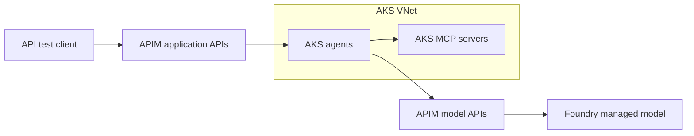

# ADR 0003: Adapt the AI Landing Zone for an AKS runtime

**Current first milestone:** [Foundry + internal APIM model gateway](../runbooks/model-gateway-first.md), with two secretless test-client IDs, content filtering, request/token limits and per-client cost reporting. AKS/ACR/MCP are removed from the active Terraform root and deferred. Earlier AKS inventory and plan evidence below are historical; this milestone supersedes that sequence.

**Scope priority:** [POC goal and success criteria](../architecture/poc-success-criteria.md) govern implementation: Copilot Studio → APIM → internal MCP on AKS, with APIM model calls and per-client token/cost attribution. Copilot connectivity is core; only its additional VNet deployment is deferred from the initial network change. RAG and GPU inference remain later extensions.

- **Date:** 2026-09-28
- **Status:** Revised per user direction: one AKS VNet now; Copilot networking and RAG deferred; endpoint details remain proposed
- **Scope:** Design and delivery plan only; no additional infrastructure deployed
- **Extends:** [ADR 0001](0001-enterprise-ai-platform-architecture.md)

## Latest access and cost refinement

The user requested internal APIM with Bastion-based administrator testing, followed by a cost review favoring non-premium tiers and one region. The prepared local revision uses APIM Developer/Internal, exact gateway private DNS, Bastion Basic, and one private Linux jump VM in the same East US VNet. Admin NAT egress is optional and disabled by default. This supersedes the earlier suggestion to defer all Bastion/DNS infrastructure and the external APIM candidate. Copilot Studio still needs its own supported private connection; Bastion is only for operators. See [cost review](../architecture/cost-review.md) for rationale and pending validation. No cloud apply has occurred.

## Context and reference

The user confirmed AKS remains the runtime for custom agents, MCP servers, and future self-hosted LLMs. Learn from the [Azure AI Landing Zones APIM reference diagram](https://github.com/Azure/AI-Landing-Zones/blob/main/media/AI-Landing-Zones-APIM.png), particularly its separation of application workloads, shared AI gateway services, and connectivity. The [reference repository](https://github.com/Azure/AI-Landing-Zones) allows its agent and gateway landing zones to be deployed independently. Its implementation is not an automatically validated blueprint for our AKS adaptation.

The existing design already has AKS, APIM, Foundry, private connectivity, and RAG. These changes clarify boundaries and sequencing rather than replace the architecture. The reference links track upstream main; implementation must record the versions of any adopted modules.

## Proposed changes

| Area | Existing direction | Refinement |
| --- | --- | --- |
| Runtime | Agents/MCP on AKS; later vLLM | Keep AKS; separate service accounts, namespaces and network policies; isolate future GPU workloads in a dedicated user node pool |
| Gateway | APIM ingress and possible model gateway | Use explicit application/MCP APIs and model APIs with separate authorization and policies; evaluate one APIM instance initially |
| Foundry | Managed models and AI capabilities | One current Foundry resource, one project, one initial chat deployment; shared model access through APIM; add projects/resources only for demonstrated isolation needs |
| Safety | Integration to validate | Test model filters immediately; define explicit moderation for future self-hosted models and optional central gateway moderation |
| Retrieval | Search and storage | Add document storage, embeddings and Search as a separate RAG phase; enforce document access before model context construction |
| Networking | Private connectivity target | One VNet for AKS now, with only subnets required by the selected AKS configuration; defer the separate Copilot connection VNet and its integration |
| Organization | One POC resource group | Keep one subscription and the existing POC group; use Terraform modules and labels for logical ownership; retain separate bootstrap group |
| Delivery | Runtime before managed models | Build the AKS network and basic model/agent/tool path first; defer RAG and Copilot networking rather than make them initial prerequisites |

## Initial scope and request paths

The immediate network scope is **one AKS VNet**. Use one AKS node subnet initially if compatible with the selected networking configuration, and add only subnets required by an actual deployed component. Choose address ranges that leave room for a non-overlapping future Copilot connection network; exact CIDRs remain to be selected.

The APIM boxes represent roles and may share one instance. APIM and Foundry network attachment and endpoint settings are deliberately not specified by this logical diagram. Use a simple sample MCP tool for the first test; no enterprise database or retrieval stack is required.

Later additions, not initial dependencies:

- **Copilot Studio:** a separate connection VNet, with peering/routing, DNS, delegation and any additional regional network requirements assessed when the integration is implemented. This is a direction, not a claim that one additional VNet alone satisfies Power Platform requirements.
- **RAG:** AI Search, document storage, ingestion and embeddings, with document authorization.
- **Self-hosted LLM:** vLLM on a dedicated GPU user node pool in the AKS environment, plus moderation and gateway routing.

## Simplifications from the previous revision

Remove the upfront private landing-zone rollout: no hub/spoke platform, firewall, VPN/ExpressRoute, Bastion, DNS Private Resolver, private build-agent subnet or dedicated private runner in the initial network plan. Do not pre-create Copilot subnets, private endpoints or DNS zones for future services. RAG moves to a later phase. Copilot connectivity/licensing feasibility is checked early because the end-to-end connection is the primary POC goal; its network resources are deployed after the initial AKS network change.

An AKS VNet does not itself make the Kubernetes API, application ingress, APIM or Foundry private. Decide those endpoint settings explicitly during implementation. A simple authenticated HTTPS path is a candidate for the POC; this design revision does not authorize exposing an existing private service or silently disabling security controls. Add private connectivity only where an agreed access requirement needs it.

## Boundaries and controls

### Gateway and identity

- Authenticate application callers and authorize application, MCP tool and model APIs separately. A subscription key may assist metering but is not the sole user identity.
- Agents and MCP servers use separate workload identities with only the necessary downstream permissions. Decide delegated user access versus application permissions for each business operation.
- Use APIM managed identity for supported Foundry authentication. Validate the chosen model API and role rather than assuming every backend has the same authorization scheme.
- Derive client attribution from validated identity and trusted application context; strip or overwrite client-supplied attribution headers. An AKS agent's identity alone does not identify its end user.
- Restrict access to model backends so application callers cannot bypass gateway policies; narrowly scope administrative/testing access. Private endpoints alone do not enforce this boundary.
- Keep APIM first. Add LiteLLM only if measured routing, protocol compatibility, metering or budget requirements cannot be met adequately. Do not assume provider usage totals equal an exact per-client invoice.

### Foundry and safety

- Use a current Foundry resource/project structure. The project supports organization, connections and applicable evaluations; it does not require moving custom agents into Foundry Agent Service.
- Do not provision the reference's full managed-agent dependency stack solely because it appears in the diagram. Cosmos DB, agent storage and other services require an actual application need.
- Keep supported managed-model filters enabled; test allowed/blocked prompts and outputs, streaming behavior, and failures. Optional explicit Content Safety calls need a defined timeout/failure policy and measured cost/latency.
- Self-hosted vLLM does not inherit Foundry filtering. Add explicit input/output moderation and evaluations before exposing it. Tool authorization, argument validation and retrieved-document defenses remain application responsibilities.
- Projects share parent resource configuration; use separate resources or subscriptions when stronger network or environment isolation becomes necessary. Do not treat a project or Kubernetes namespace as a complete security boundary.

### Networking and operations

- Keep the initial subnet/CNI design minimal. Record node, pod and service address ranges and avoid overlap with the future Copilot network. No additional VNet is created now.
- Select AKS API access and application ingress explicitly. Prefer a deployment path compatible with the existing GitHub Actions workflow where practical; if private endpoints are selected, resolve their access requirements at that point rather than prebuilding private runner infrastructure.
- Select APIM networking with the tier: inbound access and backend reachability are distinct. Verify only the features needed for the current API path against [APIM networking options](https://learn.microsoft.com/en-us/azure/api-management/virtual-network-concepts).
- Preserve the working OIDC/state bootstrap and its current network settings.
- Keep Entra authentication, workload identity, Kubernetes RBAC, resource limits, appropriate network policies and controlled image access. Simpler topology does not remove application authorization.
- Collect request traces, failures, token usage and client attribution. Keep credentials and sensitive prompt content out of logs by default.
- Keep one region, one subscription and the existing POC group. Defer enterprise connectivity, additional subscriptions, semantic cache and governance workflow infrastructure.

## Implementation sequence and acceptance criteria

| Phase | Deliverable | Completion evidence |
| --- | --- | --- |
| 0. Minimal choices | AKS VNet/CNI/IP plan, API and ingress access choice, model availability/quota, APIM tier, short-run cost estimate | Current components can communicate and be deployed; endpoint exposure and access controls documented |
| 1. AKS network | One VNet and required AKS subnet(s) | Terraform plan contains only agreed network resources; future address space does not overlap |
| 2. Managed model and gateway | One Foundry resource/project, chat model, filters and APIM model API | Authenticated model call; unauthorized call denied; usage and filter tests recorded |
| 3. AKS runtime | CPU cluster, registry, one agent, one sample MCP tool and workload identities | Client reaches agent; agent calls model through APIM and invokes the authorized tool; deployment workflow works |
| Later: RAG | Search, documents, embeddings and ingestion | Grounded citations and document access tests |
| Core follow-on: Copilot | Separate connection VNet and supported Power Platform integration | Required networking/licensing validated at that phase; authenticated end-to-end agent call |
| Later: self-hosted LLM | GPU user node pool, vLLM, moderation and model gateway route | Quota, model compatibility, safety, cost and cleanup verified |

The later extensions are independent planning items; RAG is not a prerequisite for Copilot connectivity or self-hosted inference. RAG does not block phases 0–3. Check Power Platform feasibility early; completing its configuration and end-to-end connectivity is required before declaring the core POC complete.

## Terraform and lifecycle plan

Keep `infra/poc` and `poc.tfstate` initially. Introduce modules incrementally for network, observability, Foundry, gateway, AKS and retrieval as each phase needs them. Consider pinned Azure Verified Modules where they fit; inspect defaults and avoid deploying the complete upstream stack automatically.

The current pipeline guard only permits the resource group. Update its resource/action allowlist and tests with each phase, preserving review of destructive changes. Do not simply remove the guard. The pipeline currently has Contributor on the POC group but cannot create role assignments: use the administrator bootstrap mechanism for narrowly scoped assignments initially, or record a separate decision for constrained RBAC delegation.

Retain manual plan/apply/destroy with reviewed commit evidence. Kubernetes deployment needs a tested execution path matching the chosen API access mode; private data-plane access is addressed only if selected. Keep credentials, state and plan artifacts out of Git.

Destroy in dependency order while the runner, identity, gateway connections and state backend still function. Remove application releases before their cluster; remove workload dependencies before networking; clean bootstrap last. Extend cleanup inventory if future resources leave the existing POC group. Log retention, disks, registry, private endpoints and state versions can survive selected workload shutdowns and must be included in cost/cleanup checks.

## Immediate next deliverable

Prepare the small AKS network Terraform change: one VNet, the required AKS subnet(s), and non-overlapping address ranges. Record the intended AKS networking and access mode before cluster deployment. Model and APIM selection proceed independently; neither Copilot networking nor RAG is part of this change. No paid SKU or new deployment is selected by this document.

## Additional sources

- [Foundry projects and shared resource settings](https://learn.microsoft.com/en-us/azure/foundry/how-to/create-projects)
- [Foundry model deployment options](https://learn.microsoft.com/en-us/azure/foundry/concepts/deployments-overview)
- [Azure AI Search tiers](https://learn.microsoft.com/en-us/azure/search/search-sku-tier)

Reviewed 2026-09-28. Product documentation and reference diagrams describe available patterns, not proof that this POC's end-to-end integrations have passed.
